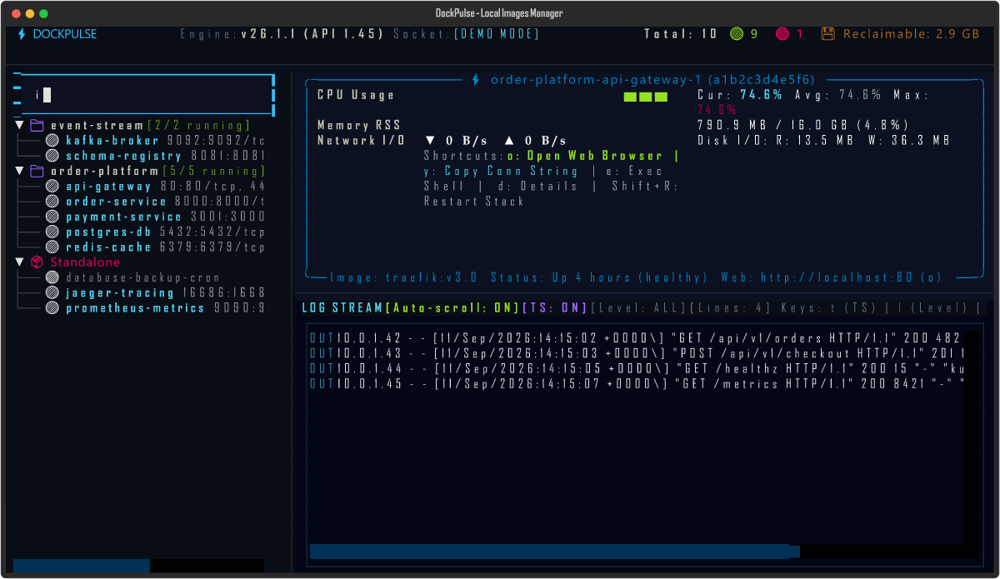
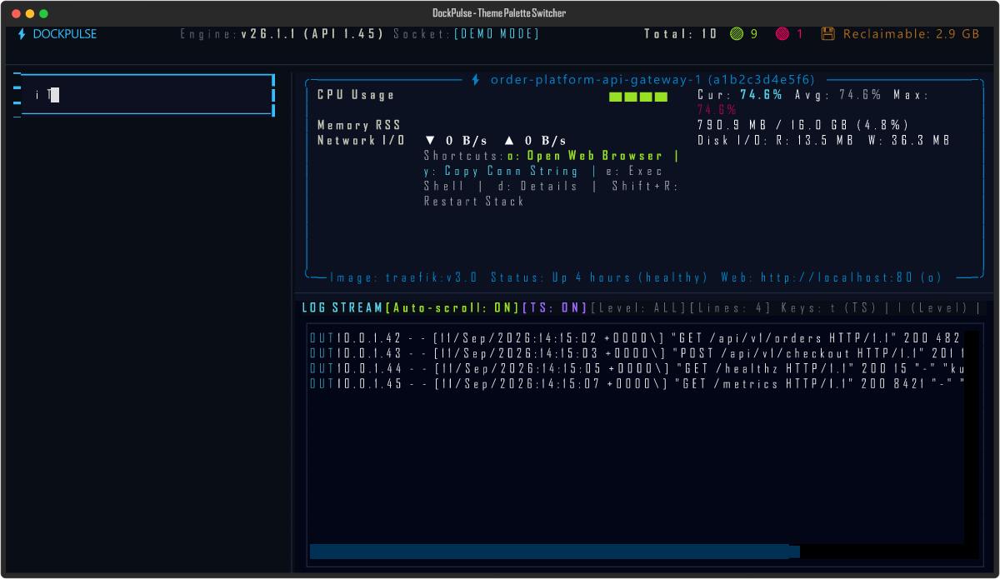

<p align="center">
  
</p>

<h1 align="center">DockPulse</h1>

<p align="center">
  High-speed, keyboard-driven terminal dashboard and CLI suite for Docker and Docker Compose. Direct engine socket connection, live rolling resource sparklines, demultiplexed log streaming, and container lifecycle controls.
</p>

<p align="center">
  <a href="https://github.com/alexandrmotologa/dockpulse/actions"></a>
  <a href="LICENSE"></a>
  <a href="https://www.python.org/downloads/"></a>
</p>

---

<p align="center">
  
</p>

---

## Features

- **Direct socket transport**: Connects to Windows Named Pipes (`\\.\pipe\docker_engine`), Unix Domain Sockets (`/var/run/docker.sock`), or remote TCP endpoints without requiring third-party bridge agents.
- **Compose project hierarchy**: Groups microservice containers by `com.docker.compose.project`, displaying status badges, service names, and replica counts.
- **Stack-level operations**: Restart (`Shift+R`) or stop (`Shift+S`) entire Compose project groups simultaneously.
- **Live resource sparklines & watchdog**: Rolling metrics for CPU %, memory RSS, network I/O, and block storage. Automatic detection of `OOMKilled` and `CrashLoop` states.
- **Demultiplexed log streaming & tools**: Reads Docker 8-byte framing headers, separating stdout and stderr streams. Toggle timestamps (`t`), cycle severity filter (`l`), export logs (`Ctrl+S`), and search (`/`).
- **Interactive utilities**: One-key web opener (`o`) for published HTTP ports, clipboard copy (`y`) for container connection strings, and interactive container shell (`e` or `Enter`).
- **Images and volumes management**: Dedicated modal inspectors to view and delete local images (`i`) and volumes (`v`).
- **Customizable themes**: Switch on the fly (`Shift+T`) between Slate, Tokyo Night, Catppuccin Mocha, Dracula, and Nord palettes, configurable via `dockpulse.toml`.
- **Integrated demo mode**: Explore the entire terminal dashboard with simulated multi-service topologies without needing a running Docker daemon (`dockpulse --demo`).

---

## Installation

### Using uv (recommended)

```bash
uv tool install dockpulse
```

Or run directly without installing:

```bash
uvx dockpulse
```

### Using pip

```bash
pip install dockpulse
```

---

## Quick Start

Launch the interactive terminal HUD:

```bash
dockpulse
```

Try the HUD in demo mode:

```bash
dockpulse --demo
```

Check Docker engine connection and socket diagnostics:

```bash
dockpulse check
```

---

## CLI Commands

DockPulse includes CLI subcommands for common operational tasks:

```bash
# Launch the interactive terminal HUD (default)
dockpulse hud

# List containers grouped by Compose project in a compact table
dockpulse ps

# Display snapshot resource statistics for active containers
dockpulse stats

# Stream demultiplexed logs for a specific container
dockpulse logs <container-name-or-id>

# Safely prune unused containers, networks, and dangling images
dockpulse prune --dry-run
```

---

## Keybindings

| Key | Action |
|---|---|
| `Up` / `Down` | Navigate container tree |
| `r` | Restart highlighted container |
| `s` | Stop highlighted container |
| `p` | Pause or unpause highlighted container |
| `x` | Remove stopped container |
| `Shift+R` | Restart entire Compose stack |
| `Shift+S` | Stop entire Compose stack |
| `o` | Open container web port in browser |
| `y` | Copy connection string or exec command to clipboard |
| `e` / `Enter` | Open container shell / command runner |
| `d` | Inspect container details (ports, mounts, env) |
| `i` | Open Docker images manager modal |
| `v` | Open Docker volumes manager modal |
| `Shift+T` | Open theme palette selector modal |
| `t` | Toggle log timestamps |
| `l` | Cycle log severity filter (ALL / ERROR / WARN / INFO / DEBUG) |
| `Ctrl+S` | Export current log buffer to file |
| `/` | Filter containers or search live logs |
| `Space` | Pause or resume log scrolling |
| `c` | Clear log buffer |
| `?` | Show help modal |
| `q` | Exit HUD |

---

## Interactive Modals

DockPulse includes built-in modal overlays for inspection, container management, and visual personalization:

| Local Images Manager (`i`) | Theme Palette Switcher (`Shift+T`) |
|---|---|
|  |  |

---

## Architecture Overview

```
+-------------------------------------------------------------+
|                        DockPulse HUD                        |
|   +---------------------+   +---------------------------+   |
|   | Container Tree      |   | Live Resource Sparklines  |   |
|   | (Grouped by Compose)|   | (CPU %, RAM, Net, Disk)   |   |
|   +---------------------+   +---------------------------+   |
|   | Status Indicators   |   | Demultiplexed Log Streamer|   |
|   +---------------------+   +---------------------------+   |
+-------------------------------------------------------------+
                              |
                     Docker REST v1.43
                              |
        +---------------------+---------------------+
        |                                           |
Windows Named Pipe                         Unix Domain Socket
(\\.\pipe\docker_engine)                   (/var/run/docker.sock)
```

See [docs/architecture.md](docs/architecture.md) and [docs/socket_transport.md](docs/socket_transport.md) for detailed technical specifications.

---

## Development

Prerequisites: Python 3.12+ and [uv](https://github.com/astral-sh/uv).

```bash
# Clone the repository
git clone https://github.com/alexandrmotologa/dockpulse.git
cd dockpulse

# Create virtual environment and install dependencies
uv sync --all-extras --dev

# Run tests
uv run pytest -v

# Run lint and formatting checks
uv run ruff check .
uv run ruff format --check .
```

---

## License

This project is licensed under the MIT License. See [LICENSE](LICENSE) for details.
